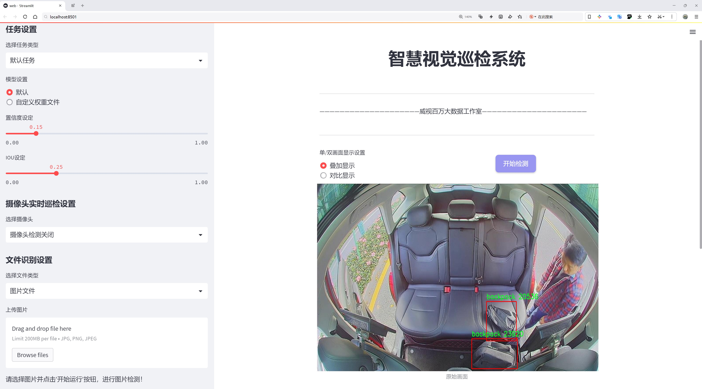
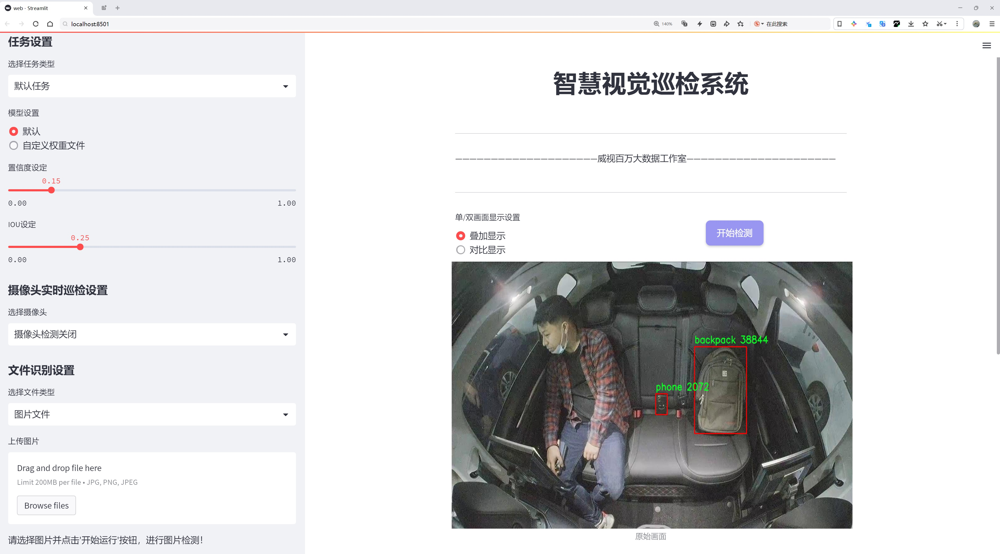
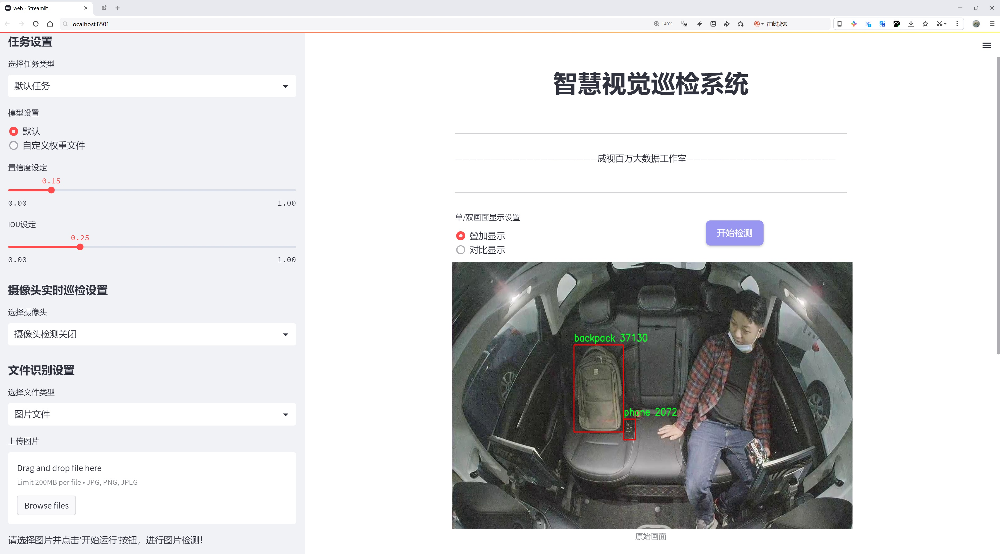
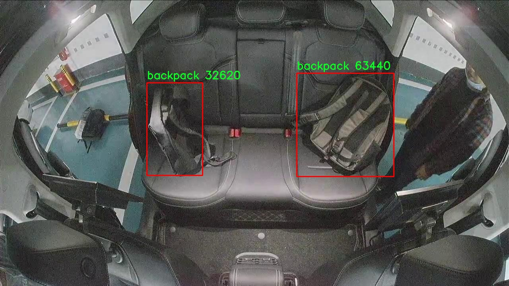
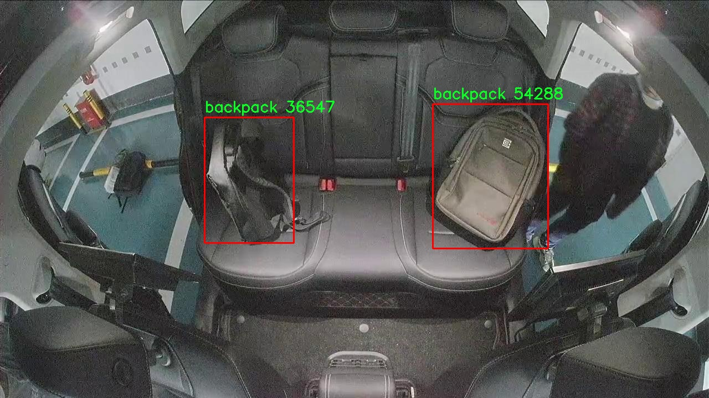
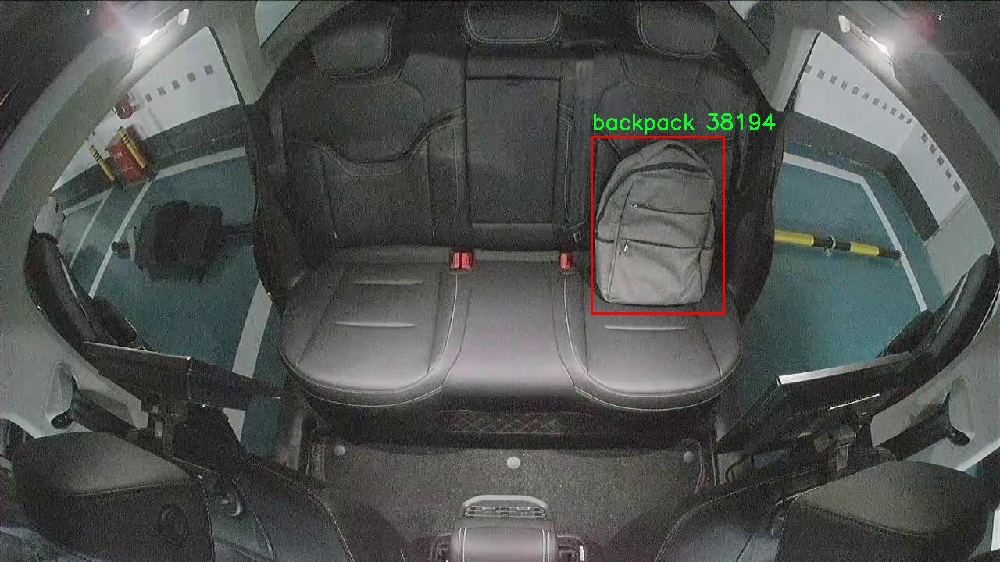
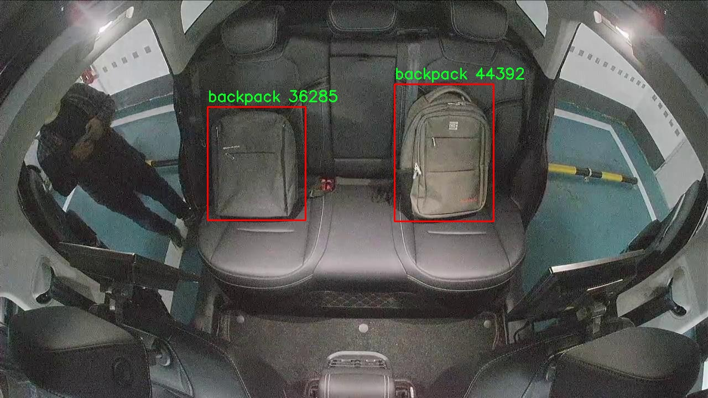
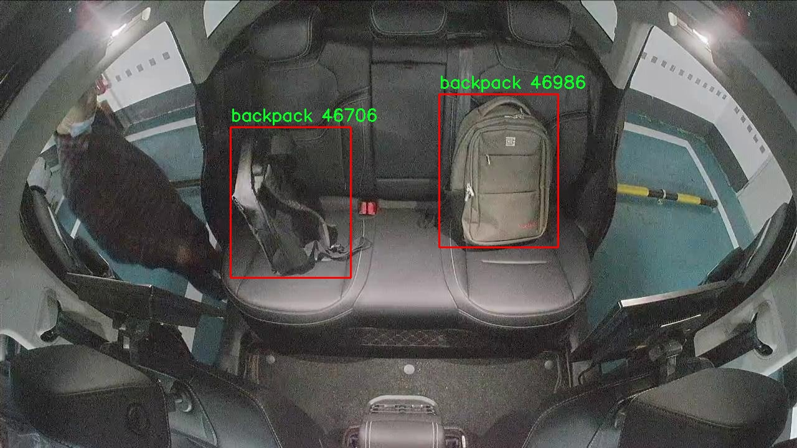

# 出租车物品遗漏检测检测系统源码分享
 # [一条龙教学YOLOV8标注好的数据集一键训练_70+全套改进创新点发刊_Web前端展示]

### 1.研究背景与意义

项目参考[AAAI Association for the Advancement of Artificial Intelligence](https://gitee.com/qunshansj/projects)

项目来源[AACV Association for the Advancement of Computer Vision](https://gitee.com/qunmasj/projects)

研究背景与意义

随着城市化进程的加快，出租车作为城市公共交通的重要组成部分，其服务质量直接影响到市民的出行体验和生活便利性。然而，在繁忙的城市生活中，乘客在出租车内遗忘物品的现象屡见不鲜，尤其是背包和手机等贵重物品的遗漏，不仅给乘客带来了经济损失，也给出租车司机和运营公司带来了额外的管理负担。因此，开发一套高效的出租车物品遗漏检测系统显得尤为重要。

近年来，深度学习技术的迅猛发展为物体检测领域带来了新的机遇。YOLO（You Only Look Once）系列模型因其高效的实时检测能力而广泛应用于各类物体检测任务。YOLOv8作为该系列的最新版本，结合了更先进的网络结构和训练策略，能够在保证检测精度的同时提高处理速度。通过对YOLOv8模型的改进，能够进一步提升其在出租车物品遗漏检测中的应用效果，尤其是在复杂的环境下对背包和手机等目标的准确识别。

本研究将基于改进的YOLOv8模型，构建一个出租车物品遗漏检测系统。该系统将利用一个包含2700张图像的数据集，数据集中主要包含两类物品：背包和手机。这些物品在出租车环境中是最常见的遗忘物品，且其外观特征明显，适合进行深度学习模型的训练和测试。通过对这些图像进行标注和处理，系统将能够学习到物品的特征，从而在实际应用中实现高效的检测。

本研究的意义不仅在于提升出租车物品遗漏的检测能力，更在于推动智能交通系统的发展。随着人工智能技术的不断进步，智能交通系统将能够更好地服务于市民，提高出行的安全性和便利性。通过实时监测和检测，出租车司机可以及时发现乘客遗留的物品，并主动与乘客联系，减少物品遗失的概率。同时，出租车公司也可以通过数据分析，优化运营管理，提高服务质量。

此外，本研究还具有重要的社会意义。物品遗漏不仅给个人带来困扰，也可能引发社会信任危机。通过建立一个高效的物品检测系统，可以增强乘客对出租车服务的信任感，提升整体社会的和谐度。未来，随着技术的不断进步，该系统还可以扩展到其他公共交通工具中，如公交车、地铁等，为更广泛的乘客群体提供便利。

综上所述，基于改进YOLOv8的出租车物品遗漏检测系统的研究，不仅具有重要的学术价值和技术意义，也为提升城市公共交通服务质量、促进社会和谐发展提供了新的思路和解决方案。

### 2.图片演示







##### 注意：由于此博客编辑较早，上面“2.图片演示”和“3.视频演示”展示的系统图片或者视频可能为老版本，新版本在老版本的基础上升级如下：（实际效果以升级的新版本为准）

  （1）适配了YOLOV8的“目标检测”模型和“实例分割”模型，通过加载相应的权重（.pt）文件即可自适应加载模型。

  （2）支持“图片识别”、“视频识别”、“摄像头实时识别”三种识别模式。

  （3）支持“图片识别”、“视频识别”、“摄像头实时识别”三种识别结果保存导出，解决手动导出（容易卡顿出现爆内存）存在的问题，识别完自动保存结果并导出到tempDir中。

  （4）支持Web前端系统中的标题、背景图等自定义修改，后面提供修改教程。

  另外本项目提供训练的数据集和训练教程,暂不提供权重文件（best.pt）,需要您按照教程进行训练后实现图片演示和Web前端界面演示的效果。

### 3.视频演示

[3.1 视频演示](https://www.bilibili.com/video/BV1JK4iefEdz/)

### 4.数据集信息展示

##### 4.1 本项目数据集详细数据（类别数＆类别名）

nc: 2
names: ['backpack', 'phone']


##### 4.2 本项目数据集信息介绍

数据集信息展示

在本研究中，我们采用了名为“backpack”的数据集，以支持对出租车物品遗漏检测系统的改进，特别是针对YOLOv8模型的训练和优化。该数据集专注于两个主要类别：背包和手机，这些物品在出租车环境中经常被遗忘或遗漏，因此具有重要的实际应用价值。通过精确识别和分类这些物品，我们的目标是提升出租车司机和乘客之间的互动效率，减少因物品遗失而导致的纠纷和不便。

“backpack”数据集的设计旨在涵盖多样化的场景和条件，以确保模型在不同环境下的鲁棒性。数据集中包含了多种不同类型的背包和手机图像，涵盖了不同的颜色、形状和尺寸。这种多样性不仅增强了模型的泛化能力，还确保了在实际应用中能够有效识别各种款式的背包和手机。例如，背包的种类包括运动背包、旅行背包、书包等，而手机则涵盖了不同品牌和型号，确保了训练数据的丰富性和代表性。

数据集的标注过程经过严格的质量控制，以确保每一张图像中的物品都被准确地标记和分类。每个图像都经过专业人员的审核，确保标注的准确性和一致性。这一过程对于训练深度学习模型至关重要，因为标注的质量直接影响到模型的学习效果和最终的检测性能。此外，数据集还包含了不同光照条件、拍摄角度和背景环境下的图像，这为模型提供了丰富的训练样本，帮助其在真实世界中应对各种复杂情况。

在训练过程中，我们将“backpack”数据集与YOLOv8模型相结合，利用其强大的特征提取能力和实时检测性能，旨在提高物品遗漏检测的准确性和效率。YOLOv8作为一种先进的目标检测算法，能够快速处理图像并进行高效的物体识别，适合于实时应用场景。通过对“backpack”数据集的深入学习，模型能够在出租车环境中快速识别出乘客遗留的背包和手机，从而及时提醒司机和乘客，减少物品遗失的可能性。

此外，我们还计划对模型进行持续的评估和优化，以确保其在实际应用中的有效性。通过不断引入新的数据样本和进行模型微调，我们希望能够进一步提升检测的准确率和响应速度。这一过程不仅有助于提升出租车服务的质量，也为乘客提供了更安全和便捷的出行体验。

综上所述，“backpack”数据集在本研究中扮演了至关重要的角色，通过其丰富的标注数据和多样化的场景设置，为改进YOLOv8的出租车物品遗漏检测系统提供了坚实的基础。随着研究的深入，我们期待能够为出租车行业带来更高效的物品管理解决方案，提升乘客的满意度和安全感。











### 5.全套项目环境部署视频教程（零基础手把手教学）

[5.1 环境部署教程链接（零基础手把手教学）](https://www.ixigua.com/7404473917358506534?logTag=c807d0cbc21c0ef59de5)


[5.2 安装Python虚拟环境创建和依赖库安装视频教程链接（零基础手把手教学）](https://www.ixigua.com/7404474678003106304?logTag=1f1041108cd1f708b01a)

### 6.手把手YOLOV8训练视频教程（零基础小白有手就能学会）

[6.1 手把手YOLOV8训练视频教程（零基础小白有手就能学会）](https://www.ixigua.com/7404477157818401292?logTag=d31a2dfd1983c9668658)

### 7.70+种全套YOLOV8创新点代码加载调参视频教程（一键加载写好的改进模型的配置文件）

[7.1 70+种全套YOLOV8创新点代码加载调参视频教程（一键加载写好的改进模型的配置文件）](https://www.ixigua.com/7404478314661806627?logTag=29066f8288e3f4eea3a4)

### 8.70+种全套YOLOV8创新点原理讲解（非科班也可以轻松写刊发刊，V10版本正在科研待更新）

由于篇幅限制，每个创新点的具体原理讲解就不一一展开，具体见下列网址中的创新点对应子项目的技术原理博客网址【Blog】：


[8.1 70+种全套YOLOV8创新点原理讲解链接](https://gitee.com/qunmasj/good)

### 9.系统功能展示（检测对象为举例，实际内容以本项目数据集为准）

图9.1.系统支持检测结果表格显示

  图9.2.系统支持置信度和IOU阈值手动调节

  图9.3.系统支持自定义加载权重文件best.pt(需要你通过步骤5中训练获得)

  图9.4.系统支持摄像头实时识别

  图9.5.系统支持图片识别

  图9.6.系统支持视频识别

  图9.7.系统支持识别结果文件自动保存

  图9.8.系统支持Excel导出检测结果数据


### 10.原始YOLOV8算法原理

原始YOLOv8算法原理

YOLOv8算法作为目标检测领域的最新进展，延续了YOLO系列模型的高效性和准确性，同时在多个方面进行了创新和优化，使其在复杂场景下的表现更加卓越。YOLOv8的设计理念在于通过精简和改进网络结构，以实现更快的推理速度和更高的检测精度。其网络结构主要由三个部分组成：Backbone（骨干网络）、Neck（颈部结构）和Head（头部结构），每个部分都在功能和性能上进行了细致的优化。

在Backbone部分，YOLOv8采用了跨级结构（Cross Stage Partial, CSP）的思想，保持了YOLOv5中的特征提取能力，但将C3模块替换为更轻量的C2f模块。C2f模块在设计上引入了更多的跳层连接，这种结构不仅提高了梯度流动的效率，还有效减少了计算量，确保了模型的轻量化。通过这样的改进，YOLOv8能够在不牺牲性能的前提下，显著提升了特征提取的速度和准确性。此外，YOLOv8保留了空间金字塔池化（SPPF）模块，这一模块在处理多尺度特征时表现出色，能够有效捕捉到不同大小目标的特征信息。

在Neck部分，YOLOv8进一步优化了特征融合的过程，所有的C3模块都被替换为C2f模块，并且在上采样阶段中删除了多余的卷积连接层。这一设计的核心在于简化特征融合的流程，使得模型在进行特征整合时更加高效，减少了不必要的计算开销，同时保持了特征信息的完整性和准确性。

YOLOv8的Head部分则引入了YOLOX中的解耦头结构，这一结构将类别和位置特征的提取过程分为两个并行的分支。这样的设计使得模型能够更专注于分类和定位任务的不同需求，从而提高了检测的精度和收敛速度。具体而言，分类任务侧重于分析特征图中提取到的特征与已知类别之间的相似性，而定位任务则更关注边界框与真实框之间的位置关系。通过这样的解耦，YOLOv8能够在同一时间内更有效地进行目标检测，显著提升了模型的整体性能。

值得一提的是，YOLOv8在损失函数的设计上也进行了创新，采用了变焦损失（Focal Loss）来计算分类损失，并引入了数据平均保真度损失和完美交并比损失来计算边界框损失。这种新的损失策略使得模型在面对不同难度的样本时，能够更加灵活地调整学习策略，从而提升检测的准确性和鲁棒性。尤其是在处理小目标或密集目标时，YOLOv8的表现相较于前代模型有了显著提升。

在训练过程中，YOLOv8也对数据增强策略进行了调整。虽然Mosaic数据增强技术在提升模型鲁棒性和泛化能力方面发挥了重要作用，但YOLOv8在训练的最后10个epoch中停止使用该技术，以避免对数据真实分布的干扰。这一策略确保了模型在训练后期能够更好地学习到真实场景中的特征，提高了模型的实用性。

总的来说，YOLOv8算法通过一系列的结构优化和创新设计，成功地在目标检测领域树立了新的标杆。其轻量化的特征提取网络、灵活的损失函数设计以及高效的特征融合策略，使得YOLOv8在实时性和准确性之间找到了良好的平衡。这些改进不仅提升了模型在各种复杂场景下的表现，也为后续的研究和应用提供了丰富的思路和基础。随着YOLOv8的不断发展和应用，其在智能监控、自动驾驶、无人机视觉等领域的潜力将得到进一步挖掘，为目标检测技术的进步贡献更多的力量。


### 11.项目核心源码讲解（再也不用担心看不懂代码逻辑）

#### 11.1 70+种YOLOv8算法改进源码大全和调试加载训练教程（非必要）\ultralytics\models\yolo\pose\train.py

以下是对代码的核心部分进行提炼和详细注释的结果：

```python
# Ultralytics YOLO 🚀, AGPL-3.0 license

from copy import copy
from ultralytics.models import yolo
from ultralytics.nn.tasks import PoseModel
from ultralytics.utils import DEFAULT_CFG, LOGGER
from ultralytics.utils.plotting import plot_images, plot_results

class PoseTrainer(yolo.detect.DetectionTrainer):
    """
    PoseTrainer类扩展了DetectionTrainer类，用于基于姿态模型的训练。
    """

    def __init__(self, cfg=DEFAULT_CFG, overrides=None, _callbacks=None):
        """初始化PoseTrainer对象，指定配置和覆盖参数。"""
        if overrides is None:
            overrides = {}
        overrides['task'] = 'pose'  # 设置任务类型为姿态估计
        super().__init__(cfg, overrides, _callbacks)  # 调用父类构造函数

        # 检查设备类型，如果是Apple MPS，给出警告
        if isinstance(self.args.device, str) and self.args.device.lower() == 'mps':
            LOGGER.warning("WARNING ⚠️ Apple MPS known Pose bug. Recommend 'device=cpu' for Pose models. "
                           'See https://github.com/ultralytics/ultralytics/issues/4031.')

    def get_model(self, cfg=None, weights=None, verbose=True):
        """获取指定配置和权重的姿态估计模型。"""
        # 创建PoseModel实例
        model = PoseModel(cfg, ch=3, nc=self.data['nc'], data_kpt_shape=self.data['kpt_shape'], verbose=verbose)
        if weights:
            model.load(weights)  # 加载权重

        return model  # 返回模型

    def set_model_attributes(self):
        """设置PoseModel的关键点形状属性。"""
        super().set_model_attributes()  # 调用父类方法
        self.model.kpt_shape = self.data['kpt_shape']  # 设置关键点形状

    def get_validator(self):
        """返回PoseValidator类的实例以进行验证。"""
        self.loss_names = 'box_loss', 'pose_loss', 'kobj_loss', 'cls_loss', 'dfl_loss'  # 定义损失名称
        return yolo.pose.PoseValidator(self.test_loader, save_dir=self.save_dir, args=copy(self.args))  # 返回验证器实例

    def plot_training_samples(self, batch, ni):
        """绘制一批训练样本，包括类标签、边界框和关键点的注释。"""
        images = batch['img']  # 获取图像
        kpts = batch['keypoints']  # 获取关键点
        cls = batch['cls'].squeeze(-1)  # 获取类标签
        bboxes = batch['bboxes']  # 获取边界框
        paths = batch['im_file']  # 获取图像文件路径
        batch_idx = batch['batch_idx']  # 获取批次索引
        
        # 绘制图像并保存
        plot_images(images,
                    batch_idx,
                    cls,
                    bboxes,
                    kpts=kpts,
                    paths=paths,
                    fname=self.save_dir / f'train_batch{ni}.jpg',
                    on_plot=self.on_plot)

    def plot_metrics(self):
        """绘制训练和验证的指标。"""
        plot_results(file=self.csv, pose=True, on_plot=self.on_plot)  # 保存结果图像
```

### 代码核心部分说明：
1. **PoseTrainer类**：该类是用于训练姿态估计模型的核心类，继承自YOLO的DetectionTrainer类。
2. **初始化方法**：设置任务类型为姿态估计，并处理设备兼容性问题。
3. **获取模型**：创建并返回PoseModel实例，支持加载预训练权重。
4. **设置模型属性**：设置模型的关键点形状，以确保模型能够正确处理输入数据。
5. **获取验证器**：返回PoseValidator实例，用于在训练过程中进行模型验证。
6. **绘制训练样本**：可视化训练样本，展示图像、边界框和关键点。
7. **绘制指标**：可视化训练和验证过程中的性能指标。

这个文件是Ultralytics YOLO项目中的一个训练模块，专门用于姿态估计（Pose Estimation）模型的训练。文件的主要内容是定义了一个名为`PoseTrainer`的类，该类继承自`DetectionTrainer`，并扩展了其功能以适应姿态模型的训练需求。

在类的初始化方法中，首先调用父类的构造函数，并设置任务类型为“pose”。如果用户指定了设备为“mps”（即Apple的Metal Performance Shaders），则会发出警告，建议使用CPU进行训练，因为在MPS上存在已知的姿态模型问题。

`get_model`方法用于获取姿态估计模型。它接受配置和权重参数，创建一个`PoseModel`实例，并在提供权重的情况下加载相应的权重。`set_model_attributes`方法则用于设置模型的关键点形状属性，以确保模型能够正确处理输入数据。

`get_validator`方法返回一个`PoseValidator`实例，用于在训练过程中进行验证。该方法还定义了损失名称，包括边界框损失、姿态损失、关键对象损失、分类损失和分布式焦点损失。

`plot_training_samples`方法用于可视化一批训练样本，包括图像、标注的类别标签、边界框和关键点。它将这些信息绘制在图像上，并保存为文件。

最后，`plot_metrics`方法用于绘制训练和验证的指标，调用`plot_results`函数生成相应的结果图。

总体来说，这个文件提供了一个结构化的方式来训练姿态估计模型，包含了模型初始化、属性设置、验证、样本可视化和指标绘制等功能，便于用户进行姿态估计任务的训练和调试。

#### 11.2 ui.py

```python
import sys
import subprocess

def run_script(script_path):
    """
    使用当前 Python 环境运行指定的脚本。

    Args:
        script_path (str): 要运行的脚本路径

    Returns:
        None
    """
    # 获取当前 Python 解释器的路径
    python_path = sys.executable

    # 构建运行命令，使用 streamlit 运行指定的脚本
    command = f'"{python_path}" -m streamlit run "{script_path}"'

    # 执行命令并等待其完成
    result = subprocess.run(command, shell=True)
    
    # 检查命令执行结果，如果返回码不为0，则表示出错
    if result.returncode != 0:
        print("脚本运行出错。")


# 实例化并运行应用
if __name__ == "__main__":
    # 指定要运行的脚本路径
    script_path = "web.py"  # 这里可以直接指定脚本名

    # 调用函数运行脚本
    run_script(script_path)
```

### 代码核心部分及注释说明：

1. **导入模块**：
   - `import sys`: 导入系统相关的模块，用于获取当前 Python 解释器的路径。
   - `import subprocess`: 导入子进程模块，用于在 Python 中执行外部命令。

2. **定义 `run_script` 函数**：
   - 该函数接受一个参数 `script_path`，表示要运行的 Python 脚本的路径。
   - 使用 `sys.executable` 获取当前 Python 解释器的路径，以确保在当前环境中运行脚本。
   - 构建一个命令字符串，使用 `streamlit` 模块运行指定的脚本。
   - 使用 `subprocess.run` 执行构建的命令，并等待其完成。
   - 检查命令的返回码，如果不为0，表示脚本运行出错，打印错误信息。

3. **主程序入口**：
   - 使用 `if __name__ == "__main__":` 确保只有在直接运行该脚本时才会执行以下代码。
   - 指定要运行的脚本路径 `script_path`，这里可以直接使用脚本名。
   - 调用 `run_script` 函数来执行指定的脚本。

这个程序文件的主要功能是使用当前的 Python 环境来运行一个指定的脚本，具体来说是一个名为 `web.py` 的脚本。程序首先导入了必要的模块，包括 `sys`、`os` 和 `subprocess`，这些模块提供了与系统交互和执行外部命令的功能。此外，还导入了 `abs_path` 函数，用于获取脚本的绝对路径。

在 `run_script` 函数中，首先获取当前 Python 解释器的路径，这样可以确保使用正确的 Python 环境来运行脚本。接着，构建一个命令字符串，该命令使用 `streamlit` 模块来运行指定的脚本。`streamlit` 是一个用于构建数据应用的流行库，通常用于快速开发和展示数据可视化应用。

然后，使用 `subprocess.run` 方法执行构建好的命令。这个方法会在新的 shell 中运行命令，并等待其完成。如果脚本运行返回的状态码不为零，表示脚本执行过程中出现了错误，程序会打印出“脚本运行出错”的提示信息。

在文件的最后部分，使用 `if __name__ == "__main__":` 语句来确保只有在直接运行该文件时才会执行后面的代码。这里指定了要运行的脚本路径为 `web.py`，并调用 `run_script` 函数来执行该脚本。

总体来说，这个程序文件的设计目的是为了方便地运行一个特定的 Python 脚本，并能够处理可能出现的错误。

#### 11.3 code\ultralytics\utils\plotting.py

以下是代码中最核心的部分，并附上详细的中文注释：

```python
class Colors:
    """
    Ultralytics 默认颜色调色板，提供了将十六进制颜色代码转换为 RGB 值的方法。
    """

    def __init__(self):
        """初始化颜色调色板，使用 matplotlib 的默认颜色。"""
        hexs = (
            "FF3838", "FF9D97", "FF701F", "FFB21D", "CFD231",
            "48F90A", "92CC17", "3DDB86", "1A9334", "00D4BB",
            "2C99A8", "00C2FF", "344593", "6473FF", "0018EC",
            "8438FF", "520085", "CB38FF", "FF95C8", "FF37C7",
        )
        # 将十六进制颜色转换为 RGB 格式并存储
        self.palette = [self.hex2rgb(f"#{c}") for c in hexs]
        self.n = len(self.palette)  # 颜色数量
        # 特定的颜色调色板
        self.pose_palette = np.array(
            [
                [255, 128, 0], [255, 153, 51], [255, 178, 102],
                [230, 230, 0], [255, 153, 255], [153, 204, 255],
                [255, 102, 255], [255, 51, 255], [102, 178, 255],
                [51, 153, 255], [255, 153, 153], [255, 102, 102],
                [255, 51, 51], [153, 255, 153], [102, 255, 102],
                [51, 255, 51], [0, 255, 0], [0, 0, 255],
                [255, 0, 0], [255, 255, 255],
            ],
            dtype=np.uint8,
        )

    def __call__(self, i, bgr=False):
        """根据索引返回 RGB 颜色值，支持 BGR 格式。"""
        c = self.palette[int(i) % self.n]
        return (c[2], c[1], c[0]) if bgr else c

    @staticmethod
    def hex2rgb(h):
        """将十六进制颜色代码转换为 RGB 值。"""
        return tuple(int(h[1 + i : 1 + i + 2], 16) for i in (0, 2, 4))


class Annotator:
    """
    Ultralytics 的注释器，用于训练/验证马赛克和 JPG 预测注释。
    """

    def __init__(self, im, line_width=None, font_size=None, font="Arial.ttf", pil=False, example="abc"):
        """初始化 Annotator 类，设置图像和注释参数。"""
        assert im.data.contiguous, "图像不连续。请对输入图像应用 np.ascontiguousarray(im)。"
        non_ascii = not is_ascii(example)  # 检查是否为非 ASCII 字符
        self.pil = pil or non_ascii  # 根据是否使用 PIL 进行绘制
        self.lw = line_width or max(round(sum(im.shape) / 2 * 0.003), 2)  # 线宽

        if self.pil:  # 使用 PIL
            self.im = im if isinstance(im, Image.Image) else Image.fromarray(im)
            self.draw = ImageDraw.Draw(self.im)
            try:
                font = check_font("Arial.Unicode.ttf" if non_ascii else font)
                size = font_size or max(round(sum(self.im.size) / 2 * 0.035), 12)
                self.font = ImageFont.truetype(str(font), size)
            except Exception:
                self.font = ImageFont.load_default()
        else:  # 使用 cv2
            self.im = im if im.flags.writeable else im.copy()
            self.tf = max(self.lw - 1, 1)  # 字体厚度
            self.sf = self.lw / 3  # 字体缩放

    def box_label(self, box, label="", color=(128, 128, 128), txt_color=(255, 255, 255), rotated=False):
        """在图像上添加一个带标签的矩形框。"""
        if isinstance(box, torch.Tensor):
            box = box.tolist()
        if self.pil or not is_ascii(label):
            if rotated:
                self.draw.polygon([tuple(b) for b in box], width=self.lw, outline=color)  # 绘制多边形
            else:
                self.draw.rectangle(box, width=self.lw, outline=color)  # 绘制矩形
            if label:
                w, h = self.font.getsize(label)  # 获取文本宽度和高度
                p1 = (box[0], box[1])
                outside = p1[1] - h >= 0  # 标签是否适合框外
                self.draw.rectangle(
                    (p1[0], p1[1] - h if outside else p1[1], p1[0] + w + 1, p1[1] + 1 if outside else p1[1] + h + 1),
                    fill=color,
                )
                self.draw.text((p1[0], p1[1] - h if outside else p1[1]), label, fill=txt_color, font=self.font)
        else:  # cv2
            p1, p2 = (int(box[0]), int(box[1])), (int(box[2]), int(box[3]))
            cv2.rectangle(self.im, p1, p2, color, thickness=self.lw, lineType=cv2.LINE_AA)  # 绘制矩形
            if label:
                w, h = cv2.getTextSize(label, 0, fontScale=self.sf, thickness=self.tf)[0]  # 获取文本宽度和高度
                outside = p1[1] - h >= 3
                p2 = p1[0] + w, p1[1] - h - 3 if outside else p1[1] + h + 3
                cv2.rectangle(self.im, p1, p2, color, -1, cv2.LINE_AA)  # 填充矩形
                cv2.putText(
                    self.im,
                    label,
                    (p1[0], p1[1] - 2 if outside else p1[1] + h + 2),
                    0,
                    self.sf,
                    txt_color,
                    thickness=self.tf,
                    lineType=cv2.LINE_AA,
                )

    def result(self):
        """返回注释后的图像数组。"""
        return np.asarray(self.im)
```

以上代码中，`Colors` 类用于管理颜色调色板，而 `Annotator` 类则用于在图像上绘制注释（如矩形框和文本）。这些类的核心功能包括颜色转换和图像注释，适用于计算机视觉任务中的数据可视化。

这个程序文件是Ultralytics YOLO项目中的一个绘图工具，主要用于处理图像的可视化和注释。文件中包含多个类和函数，下面对其主要内容进行说明。

首先，文件导入了一些必要的库，包括用于图像处理的OpenCV和PIL，数据处理的NumPy和Pandas，以及用于绘图的Matplotlib。还导入了一些Ultralytics项目的工具和日志记录器。

接下来，定义了一个`Colors`类，用于管理颜色调色板。该类提供了将十六进制颜色代码转换为RGB值的方法，并定义了一组默认的颜色用于绘图。该类的实例在后续的绘图过程中被频繁使用。

然后，定义了一个`Annotator`类，负责在图像上添加注释和绘制图形。这个类支持使用PIL或OpenCV进行绘图，允许用户在图像上绘制矩形框、文本、关键点、掩膜等。该类还包含了处理人体姿态关键点的逻辑，包括绘制骨架和关键点的颜色设置。

`Annotator`类中的主要方法包括：
- `box_label`：在图像上绘制矩形框并添加标签。
- `masks`：在图像上绘制掩膜。
- `kpts`：在图像上绘制关键点。
- `rectangle`和`text`：用于绘制矩形和文本。
- `fromarray`：将NumPy数组转换为PIL图像。
- `result`：返回注释后的图像。

此外，还有一些特定的绘图方法，例如`draw_region`用于绘制区域，`draw_centroid_and_tracks`用于绘制跟踪轨迹，`count_labels`用于显示计数等。

文件中还定义了一些用于绘制训练标签和结果的函数，如`plot_labels`和`plot_results`。这些函数通过读取数据并生成相应的图表，帮助用户可视化模型的训练过程和结果。

最后，文件中还包含一些用于输出和可视化特征图的函数，如`feature_visualization`，以及用于将模型输出转换为目标格式的函数，如`output_to_target`和`output_to_rotated_target`。

整体而言，这个文件为YOLO模型的可视化和结果分析提供了丰富的工具，帮助用户更好地理解和评估模型的性能。

#### 11.4 70+种YOLOv8算法改进源码大全和调试加载训练教程（非必要）\ultralytics\data\__init__.py

```python
# 导入必要的模块和类
# Ultralytics YOLO 🚀, AGPL-3.0 license

# 从基础模块导入 BaseDataset 类
from .base import BaseDataset

# 从构建模块导入构建数据加载器和YOLO数据集的函数
from .build import build_dataloader, build_yolo_dataset, load_inference_source

# 从数据集模块导入分类数据集、语义数据集和YOLO数据集的类
from .dataset import ClassificationDataset, SemanticDataset, YOLODataset

# 定义模块的公开接口，包含所有需要导出的类和函数
__all__ = (
    'BaseDataset',          # 基础数据集类
    'ClassificationDataset', # 分类数据集类
    'SemanticDataset',      # 语义分割数据集类
    'YOLODataset',          # YOLO数据集类
    'build_yolo_dataset',   # 构建YOLO数据集的函数
    'build_dataloader',     # 构建数据加载器的函数
    'load_inference_source'  # 加载推理源的函数
)
```

### 代码核心部分说明：
1. **导入模块**：代码首先导入了几个必要的模块和类，这些是构建YOLO（You Only Look Once）模型所需的基础组件。
   - `BaseDataset` 是所有数据集的基类，提供了一些基本的功能。
   - `build_dataloader`、`build_yolo_dataset` 和 `load_inference_source` 是用于构建数据加载器和数据集的函数，方便后续的数据处理和模型训练。
   - `ClassificationDataset`、`SemanticDataset` 和 `YOLODataset` 是具体的数据集实现，分别用于分类、语义分割和YOLO目标检测。

2. **定义公开接口**：`__all__` 列表定义了该模块的公开接口，明确了哪些类和函数可以被外部导入和使用。这是为了控制模块的可见性，避免不必要的内部实现被外部访问。

这个程序文件是Ultralytics YOLO项目中的一个初始化文件，主要用于定义和导入与数据集相关的模块和类。文件开头的注释表明该项目使用的是AGPL-3.0许可证，说明其开源性质。

在代码中，首先从当前包中导入了几个重要的组件，包括`BaseDataset`、`build_dataloader`、`build_yolo_dataset`和`load_inference_source`。这些组件分别负责基础数据集的定义、数据加载器的构建、YOLO数据集的构建以及推理源的加载。

接下来，`ClassificationDataset`、`SemanticDataset`和`YOLODataset`这三个类也被导入，它们分别代表不同类型的数据集，适用于分类任务、语义分割任务和YOLO目标检测任务。

最后，`__all__`变量被定义为一个包含所有导入类和函数的元组。这意味着当使用`from module import *`语句时，只会导入这些指定的组件，从而避免不必要的命名冲突，保持模块的整洁性。

总的来说，这个文件的主要功能是集中管理与数据集相关的类和函数，为YOLOv8算法的训练和推理提供必要的数据处理支持。

#### 11.5 train.py

以下是经过简化并添加详细中文注释的核心代码部分：

```python
import random
import numpy as np
import torch.nn as nn
from ultralytics.data import build_dataloader, build_yolo_dataset
from ultralytics.engine.trainer import BaseTrainer
from ultralytics.models import yolo
from ultralytics.nn.tasks import DetectionModel
from ultralytics.utils import LOGGER, RANK
from ultralytics.utils.torch_utils import de_parallel, torch_distributed_zero_first

class DetectionTrainer(BaseTrainer):
    """
    扩展自 BaseTrainer 类，用于基于检测模型的训练。
    """

    def build_dataset(self, img_path, mode="train", batch=None):
        """
        构建 YOLO 数据集。

        参数:
            img_path (str): 包含图像的文件夹路径。
            mode (str): 模式，`train` 或 `val`，用户可以为每种模式自定义不同的增强。
            batch (int, optional): 批次大小，仅用于 `rect` 模式。默认为 None。
        """
        gs = max(int(de_parallel(self.model).stride.max() if self.model else 0), 32)
        return build_yolo_dataset(self.args, img_path, batch, self.data, mode=mode, rect=mode == "val", stride=gs)

    def get_dataloader(self, dataset_path, batch_size=16, rank=0, mode="train"):
        """构造并返回数据加载器。"""
        assert mode in ["train", "val"]
        with torch_distributed_zero_first(rank):  # 仅在 DDP 中初始化数据集 *.cache 一次
            dataset = self.build_dataset(dataset_path, mode, batch_size)
        shuffle = mode == "train"  # 训练模式下打乱数据
        workers = self.args.workers if mode == "train" else self.args.workers * 2
        return build_dataloader(dataset, batch_size, workers, shuffle, rank)  # 返回数据加载器

    def preprocess_batch(self, batch):
        """对一批图像进行预处理，包括缩放和转换为浮点数。"""
        batch["img"] = batch["img"].to(self.device, non_blocking=True).float() / 255  # 将图像转换为浮点数并归一化
        if self.args.multi_scale:  # 如果启用多尺度
            imgs = batch["img"]
            sz = (
                random.randrange(self.args.imgsz * 0.5, self.args.imgsz * 1.5 + self.stride)
                // self.stride
                * self.stride
            )  # 随机选择尺寸
            sf = sz / max(imgs.shape[2:])  # 计算缩放因子
            if sf != 1:
                ns = [
                    math.ceil(x * sf / self.stride) * self.stride for x in imgs.shape[2:]
                ]  # 计算新的形状
                imgs = nn.functional.interpolate(imgs, size=ns, mode="bilinear", align_corners=False)  # 进行插值
            batch["img"] = imgs
        return batch

    def get_model(self, cfg=None, weights=None, verbose=True):
        """返回 YOLO 检测模型。"""
        model = DetectionModel(cfg, nc=self.data["nc"], verbose=verbose and RANK == -1)
        if weights:
            model.load(weights)  # 加载权重
        return model

    def plot_training_samples(self, batch, ni):
        """绘制带有注释的训练样本。"""
        plot_images(
            images=batch["img"],
            batch_idx=batch["batch_idx"],
            cls=batch["cls"].squeeze(-1),
            bboxes=batch["bboxes"],
            paths=batch["im_file"],
            fname=self.save_dir / f"train_batch{ni}.jpg",
            on_plot=self.on_plot,
        )
```

### 代码核心部分说明：
1. **构建数据集**：`build_dataset` 方法用于根据指定的图像路径和模式（训练或验证）构建 YOLO 数据集，并应用适当的增强。
2. **获取数据加载器**：`get_dataloader` 方法构造并返回数据加载器，确保在分布式训练时只初始化一次数据集。
3. **预处理批次**：`preprocess_batch` 方法对输入的图像批次进行预处理，包括归一化和多尺度调整。
4. **获取模型**：`get_model` 方法返回一个 YOLO 检测模型，并可选择加载预训练权重。
5. **绘制训练样本**：`plot_training_samples` 方法用于可视化训练样本及其对应的标签和边界框。

以上是代码的核心功能和注释，旨在帮助理解 YOLO 检测模型的训练过程。

这个程序文件 `train.py` 是一个用于训练 YOLO（You Only Look Once）目标检测模型的 Python 脚本，属于 Ultralytics YOLO 项目的一部分。该文件定义了一个名为 `DetectionTrainer` 的类，继承自 `BaseTrainer` 类，专门用于处理目标检测任务。

在这个类中，首先定义了 `build_dataset` 方法，用于构建 YOLO 数据集。该方法接收图像路径、模式（训练或验证）和批量大小作为参数。它通过调用 `build_yolo_dataset` 函数来创建数据集，并根据模型的步幅设置适当的参数。

接下来，`get_dataloader` 方法用于构建数据加载器。它确保在分布式训练时只初始化一次数据集，并根据模式选择是否打乱数据。该方法还会根据训练或验证模式调整工作线程的数量。

`preprocess_batch` 方法负责对图像批次进行预处理，包括将图像缩放到适当的大小并转换为浮点数。它还支持多尺度训练，通过随机选择图像大小来增强模型的鲁棒性。

`set_model_attributes` 方法用于设置模型的属性，包括类别数量和类别名称。这些信息将帮助模型在训练过程中进行正确的预测。

`get_model` 方法返回一个 YOLO 检测模型实例，并可以选择加载预训练权重。`get_validator` 方法则返回一个用于验证模型性能的 `DetectionValidator` 实例。

`label_loss_items` 方法用于返回一个包含训练损失项的字典，方便后续的损失监控和分析。`progress_string` 方法生成一个格式化的字符串，用于显示训练进度，包括当前的 epoch、GPU 内存使用情况和损失值等信息。

此外，`plot_training_samples` 方法用于绘制训练样本及其标注，便于可视化训练过程中的数据。`plot_metrics` 和 `plot_training_labels` 方法则用于绘制训练过程中的各种指标和标签，帮助分析模型的训练效果。

总体而言，这个文件提供了一个完整的框架，用于训练 YOLO 模型，包括数据集构建、数据加载、模型设置、损失计算和结果可视化等功能，适合用于目标检测任务的研究和应用。

#### 11.6 code\ultralytics\models\yolo\classify\__init__.py

以下是代码中最核心的部分，并附上详细的中文注释：

```python
# 导入Ultralytics YOLO库中的分类模型相关模块
from ultralytics.models.yolo.classify.predict import ClassificationPredictor  # 导入分类预测器
from ultralytics.models.yolo.classify.train import ClassificationTrainer      # 导入分类训练器
from ultralytics.models.yolo.classify.val import ClassificationValidator      # 导入分类验证器

# 定义模块的公开接口，指定可以被外部访问的类
__all__ = "ClassificationPredictor", "ClassificationTrainer", "ClassificationValidator"
```

### 代码注释说明：
1. **导入模块**：
   - `ClassificationPredictor`：用于对图像进行分类预测的类。
   - `ClassificationTrainer`：用于训练分类模型的类。
   - `ClassificationValidator`：用于验证分类模型性能的类。

2. **`__all__`**：
   - 该变量定义了模块的公共接口，指定了在使用 `from module import *` 时可以导入的类。这有助于控制模块的可见性，避免不必要的名称冲突。

这个程序文件是Ultralytics YOLO（You Only Look Once）模型的一部分，主要用于分类任务。文件的开头包含了一条注释，说明该项目遵循AGPL-3.0许可证，并且是Ultralytics团队开发的。

接下来，文件通过`from`语句导入了三个类：`ClassificationPredictor`、`ClassificationTrainer`和`ClassificationValidator`。这些类分别用于模型的预测、训练和验证功能。具体来说，`ClassificationPredictor`负责处理分类任务的预测过程，`ClassificationTrainer`用于训练分类模型，而`ClassificationValidator`则用于验证模型的性能。

最后，`__all__`变量定义了该模块公开的接口，包含了三个导入的类名。这意味着当其他模块使用`from ultralytics.models.yolo.classify import *`语句时，只会导入这三个类，确保模块的封装性和可用性。

总的来说，这个文件的主要作用是组织和暴露与YOLO分类相关的功能模块，方便其他部分的代码进行调用和使用。

### 12.系统整体结构（节选）

### 整体功能和构架概括

Ultralytics YOLO项目是一个开源的目标检测和分类框架，主要基于YOLOv8算法。该项目的设计目标是提供一个灵活且高效的工具集，以便于用户进行目标检测、分类和姿态估计等任务。项目的整体架构由多个模块组成，每个模块负责特定的功能，包括数据处理、模型训练、验证、预测和可视化等。

- **数据处理**：通过`data`模块提供数据集的构建和加载功能。
- **模型训练**：`train.py`和各个分类、姿态估计模块负责模型的训练过程。
- **模型验证**：通过`val.py`和相应的验证类，提供模型性能评估功能。
- **预测**：分类和姿态估计模块提供预测功能。
- **可视化**：`plotting.py`模块负责结果的可视化，帮助用户理解模型的表现。

### 文件功能整理表

| 文件路径                                                                 | 功能描述                                                     |
|------------------------------------------------------------------------|------------------------------------------------------------|
| `70+种YOLOv8算法改进源码大全和调试加载训练教程（非必要）\ultralytics\models\yolo\pose\train.py` | 定义姿态估计模型的训练过程，包括数据加载、模型设置和可视化。 |
| `ui.py`                                                               | 运行指定的脚本（如`web.py`），用于用户界面交互。             |
| `code\ultralytics\utils\plotting.py`                                  | 提供绘图工具，用于可视化训练样本、损失和模型结果。           |
| `70+种YOLOv8算法改进源码大全和调试加载训练教程（非必要）\ultralytics\data\__init__.py` | 初始化数据模块，导入与数据集相关的类和函数。                |
| `train.py`                                                            | 定义目标检测模型的训练过程，包括数据集构建和损失计算。      |
| `code\ultralytics\models\yolo\classify\__init__.py`                  | 初始化分类模块，导入分类相关的类（预测、训练、验证）。     |
| `val.py`                                                              | 定义模型验证过程，评估模型在验证集上的性能。                |
| `code\ultralytics\utils\torch_utils.py`                               | 提供与PyTorch相关的工具函数，支持模型训练和推理。           |
| `code\ultralytics\models\nas\val.py`                                  | 处理神经架构搜索（NAS）模型的验证过程。                     |
| `code\ultralytics\models\yolo\obb\__init__.py`                        | 初始化与YOLO目标检测相关的其他模块（如OBB）。               |
| `70+种YOLOv8算法改进源码大全和调试加载训练教程（非必要）\ultralytics\utils\plotting.py` | 提供绘图工具，用于可视化训练样本、损失和模型结果（重复）。   |
| `70+种YOLOv8算法改进源码大全和调试加载训练教程（非必要）\ultralytics\models\__init__.py` | 初始化模型模块，导入与YOLO模型相关的类和函数。              |
| `70+种YOLOv8算法改进源码大全和调试加载训练教程（非必要）\ultralytics\nn\extra_modules\orepa.py` | 提供额外的神经网络模块，可能用于特定的模型改进或扩展。      |

这个表格总结了每个文件的主要功能，帮助理解Ultralytics YOLO项目的整体结构和各个模块之间的关系。

注意：由于此博客编辑较早，上面“11.项目核心源码讲解（再也不用担心看不懂代码逻辑）”中部分代码可能会优化升级，仅供参考学习，完整“训练源码”、“Web前端界面”和“70+种创新点源码”以“13.完整训练+Web前端界面+70+种创新点源码、数据集获取”的内容为准。

### 13.完整训练+Web前端界面+70+种创新点源码、数据集获取


# [下载链接：https://mbd.pub/o/bread/ZpuTmpdy](https://mbd.pub/o/bread/ZpuTmpdy)